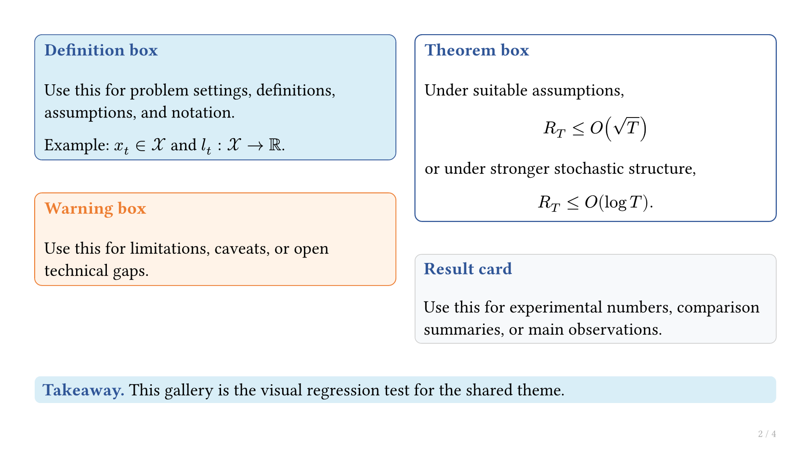

# typst-math-slides

A Typst + Touying starter kit for mathematical research talks.

`typst-math-slides` is an opinionated starting point for theorem-heavy seminar,
reading group, and conference slides. It combines Touying's slide engine with a
small set of reusable components for definitions, theorems, results, plots, and
takeaways.

It is designed for people who want to write the talk content in small
`slides/*.typ` files while keeping the visual system stable in one reusable
shared design repository.

## Position

`typst-math-slides` is not a replacement for Touying. It is a small design layer
built on top of Touying's `simple-theme`.

Use it when you want:

- a starter kit for mathematical research talks, not a general slide framework
- reusable blocks for definitions, theorems, results, plots, and takeaways
- a gallery PDF that shows every public component in context
- a shared design repository that can be reused from talk repositories as a Git
  submodule
- a workflow where each talk edits its own `slides/` files and imports the same
  shared design layer

## What You Get

- `lib.typ`: the reusable Typst/Touying component library
- `examples/gallery`: a component gallery for visual checks
- `examples/minimal`: a small starter deck
- `docs/style-guide.md`: design and structure notes
- `CONTRIBUTING.md`: contribution scope and review checklist

## Preview



## Requirements

- Typst CLI
- Internet access the first time Typst downloads `@preview/touying:0.7.4`

Check your Typst version:

```bash
typst --version
```

## Quick Start

Render the component gallery:

```bash
typst compile --root . examples/gallery/main.typ build/gallery.pdf
```

Open the generated PDF:

```bash
open build/gallery.pdf
```

The gallery is the main visual regression check. Run it whenever you change
`lib.typ`.

## Minimal Example

Render the smaller starter deck:

```bash
typst compile --root . examples/minimal/main.typ build/minimal.pdf
```

The `--root .` flag is intentional. The examples import the top-level `lib.typ`,
so Typst needs the repository root as the project root.

## Repository Layout

```text
typst-math-slides/
  lib.typ                         # reusable theme components
  README.md
  CONTRIBUTING.md
  docs/
    style-guide.md
  examples/
    gallery/
      main.typ
      slides/
        00-components.typ
        01-math-layout.typ
    minimal/
      main.typ
      preamble.typ
      slides/
        00-title.typ
  build/                          # generated PDFs, ignored by Git
```

## Components

The public components live in `lib.typ`.

| Role | Components | Use them for |
| --- | --- | --- |
| Slide setup | `research-theme`, `research-slide`, `title-block` | Initialize the deck and build title slides. |
| Content blocks | `definition-box`, `theorem-box`, `result-card`, `warning-box`, `takeaway` | Structure definitions, claims, results, caveats, and final messages. |
| Figure support | `plot-placeholder` | Reserve stable space for plots before final figures are ready. |
| Layout utilities | `two-col`, `three-col` | Build common two- and three-column mathematical slide layouts. |
| Text utilities | `key`, `small-note` | Emphasize key terms and add compact supporting notes. |

See `examples/gallery` for rendered usage examples.

## Usage as a Git Submodule

In a talk repository:

```bash
mkdir -p themes
git submodule add <REPO_URL> themes/typst-math-slides
```

Create `preamble.typ` in the talk repository:

```typst
#import "themes/typst-math-slides/lib.typ": *
```

Create `main.typ`:

```typst
#import "preamble.typ": *

#show: research-theme

#set text(size: 18pt)
#set par(justify: false, leading: 0.62em)

#include "slides/00-title.typ"
```

Each slide file should import the talk preamble:

```typst
#import "../preamble.typ": *
```

That keeps the talk content in the talk repository while the visual system stays
in the submodule.

## Working on the Theme

When changing `lib.typ`:

1. Update or add a gallery slide under `examples/gallery/slides/`.
2. Rebuild the gallery:

   ```bash
   typst compile --root . examples/gallery/main.typ build/gallery.pdf
   ```

3. Rebuild the minimal example:

   ```bash
   typst compile --root . examples/minimal/main.typ build/minimal.pdf
   ```

4. Check that generated PDFs are not committed.

See `CONTRIBUTING.md` for the contribution checklist.

## Built on Touying

This project imports Touying and uses its `simple-theme` as the slide engine:

```typst
#import "@preview/touying:0.7.4": *
#import themes.simple: *
```

Touying provides the presentation framework. `typst-math-slides` adds a focused
set of mathematical research slide components and examples.
